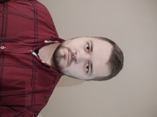

## RS-School 2022

---

---
# SERGEY BALDIN

---
## Contacts:
* **E**-mail:  _sergey.baldin.98@mail.ru_  
* **P**hone:  _+375(33)62-29-512_
* **G**ITHUB:  _[sergeybaldin98](https://github.com/sergeybaldin98)_
---
## About:
My name is Sergey Baldin. Half a year ago, I graduated as a software engineer. Familiar with the basics of HTML, CSS and OOP. In this course I want to improve my skills and gain more knowledge. My hobbies are reading, watching movies and drawing.

___
## Skills:
   
___
## Education:
1. **Grodno State Polytechnic College** - _technician_ (2013-2017)
2. **Belarusian National Technical University** - _software engineer_ (2017-2021)
---
## EXPERIENCE
1. **JSC "Shchuchin Repair Plant"** - *Supply and sales engineer* (2017-2021)

---
## Languages:
* English - A2

---
## Code example:
```JS
function multiply(a, b){
  return a * b;
}
```
---
## RS-School 2022        
_CV#1. Markdown & GIT_
