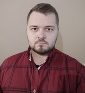

# RS-School 2023

---



---

# SERGEY BALDIN

---

## Contacts:
* **E**-mail:  _sergey.baldin.98@mail.ru_
* **P**hone:  _+375(33)62-29-512_
* **G**ITHUB:  _[sergeybaldin98](https://github.com/sergeybaldin98)_

---

## About:
My name is Sergey Baldin. A year ago, I graduated as a software engineer. Familiar with the basics of HTML, CSS and OOP. In this course I want to improve my skills and gain more knowledge. My hobbies are reading, watching movies and drawing.

---

## Skills:
   
  

---

## Education:
1. **Grodno State Polytechnic College** - _technician_ (2013-2017)
2. **Belarusian National Technical University** - _software engineer_ (2017-2021)

---

## EXPERIENCE
1. **JSC "Shchuchin Repair Plant"** - *Supply and sales engineer* (2017-2021)
2. **JSC "Shchuchin Repair Plant"** - *Leading specialist in foreign economic activity* (2021-2023)

---

## Languages:
* **E**nglish - A2

---

## Code example:
```JS
function maskify(cc) {
  let arr = [];
  for (let i = 0; i<cc.length-4; i++){
    arr.push("#");
  }
  for(let i=cc.length-4; i<cc.length; i++){
    arr.push(cc[i]);
  }
  return arr.join('');
}
```

---


[](https://rs.school/js/)